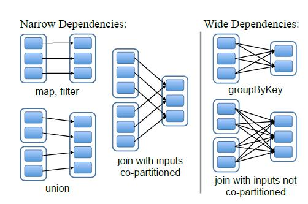
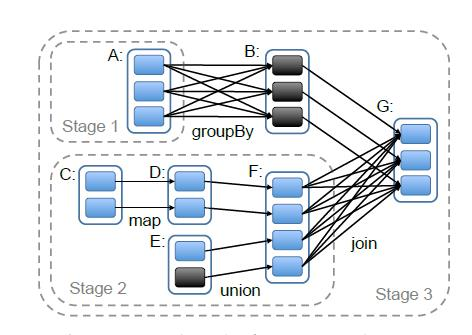
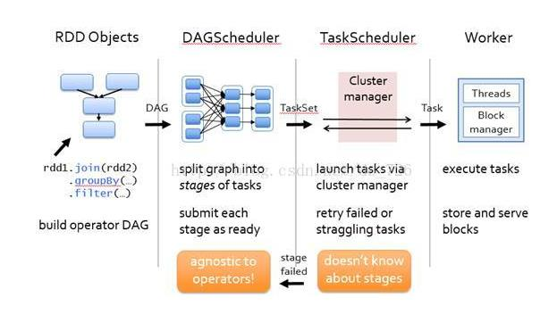

#RDD / Spark 

##现有模式存在的问题：
在Spark之前，很多大数据的计算架构效率比较低，尤其是对于需要迭代计算和交互计算的应用，因为之前的架构不是in-memory computing的，而很多大数据的算法都需要重用中间结果，在中间结果的基础上进行计算，所以处理这类问题的时候，之前的解决方只能是向外部的storage输出计算的中间结果，这就因为disk I/O的限制，导致性能的问题，虽然也有很多框架着手解决这一问题，但没法高效地解决诸如faultTolerance的问题

##本文的解决的方案：
提出了Resilient Distributed Dataset，以及基于RDD计算模型的Spark。可以在大规模的计算集群上面运行in-memory computing的算法，和基于coarse-grained transformation。

###RDD的概念: 
RDD是一个数据模型，可以把RDD理解成Spark当中的一种数据结构，Spark当中的操作都是对于RDD这种数据结构的操作

###RDD的特点

#####1. RDD是只读的，分区的记录集合。
一个RDD只能从另一个RDD或者源数据修改过来，而不能对一个RDD进行修改
通过并行转换的方式来创建（如map, filter, join）
#####2. RDD支持两种操作： 转换和动作
转换（ transformation ） 从现有的数据集创建一个新的数据集； 动作（actions）是在数据集上运行计算后，返回一个值给驱动程序。Spark中的所有转换都是惰性的，也就是说，他们并不会直接计算结果。相反的，它们只是记住应用到基础数据集（例如一个文件）上的这些转换动作。只有当发生一个要求返回结果给Driver的动作时，这些转换才会真正运行。

###RDD的优点
####1.In-memory computing
数据集的全部或者部分可以缓存在内存中，以便在迭代计算的时候可以重复利用，减少了I/O的开销，当内存不够时，可以与磁盘进行交换。用户可以显式地指定哪一部分分区的数据可以缓存在内存中，以及内存不够时缓存这些分区的优先级。RDD只能通过对稳定物理存储中的数据或者其他已有的RDD执行一些确定性操作来创建。这些操作被称作transformation，常见的transformation包括map, filter,join等。而且，用户可以显式地指定RDD的存储方式和分区方式（比如指定哪个RDD会被重用，用persist指令让它保留在内存中）决定RDD中的元素按照某个key来划分，及其划分的方式等。
####2.Fault-Tolerance
一个RDD有足够的信息(lineage)关于它自身是如何从其他数据集或其他RDD衍生而来的，使用这些信息，利用稳定存储中的数据可以再次计算出这个RDD中的分区。Spark可以根据lineage的信息重建丢失的RDD分区，而不需在各个结点之间拷贝大量的数据副本，没有checkpoint的开销。
####3.Straggler Mitigation
因为产生的RDD都是只读的，要做出修改只能新产生RDD，所以对于那些运算的比较慢的节点，可以并行地进行计算避免被拖延，而像DSM这种计算模型就只能等待
####4.Data Locality and Graceful Degration
系统可以对RDD进行划分和安排，这就可以利用计算几点的locality来提高计算性能；在内存不够的时候，那些大的、没有被特别指定的RDD会被降级，写到硬盘里面，这个时候性能会有所下降但不会低于Mapreduce

###RDD（Spark）提供的接口:

####1. transformation:
这些操作创建一个RDD或者转换出一个新的RDD
- map:
对RDD中的每个元素都执行一个指定的函数来产生一个新的RDD
- filter:
对之前的RDD进行筛选
- flatMap：
与map类似，区别是经map处理后只能生成一个元素，而经flatmap处理后可生成多个元素来构建新RDD

####2. action:
这些操作给应用程序返回一个结果或者向存储系统中写入数据
- reduce:
将RDD中元素两两传递给输入函数，同时产生一个新的值，新产生的值与RDD中下一个元素再被传递给输入函数直到最后只有一个值为止
- count:
返回数据集中元素的个数
- collect:
返回元素本身
- save:
向存储系统写入数据集
- persist:
指定以后要复用的RDD，spark默认将要复用的RDD放在内存中
Spark中RDD的内部接口：
- partitions()：
返回一组Partition对象
- preferredLocations(p):
根据数据存放的位置，返回分区p在哪些节点访问更快
- dependencies():
返回一组依赖
- iterator(p, parentIters)：
按照父分区的迭代器，逐个计算分区p的元素
- partitioner():
返回RDD是否被hash/range分区的元数据信息

###论文中代码的执行：

####一、

第一行定义了一个由HDFS保存的RDD
第二行将第一行产生的RDD过滤掉不必要的信息，保留以ERROR开头的信息，产生新的RDD
第三行将error RDD保留在内存中，以便于它可以被跨查询共享。Spark会将error的分区保存在内存中
然后对error RDD再次过滤出包含"HDFS"的数据项，然后筛选出以制表符分隔的第三个字段。Spark调度器会将这些transformation指令发送给缓存着errors分区的结点。最后将结果记录返回。

####二、逻辑回归

将文本文件的每一行做map转换解析成Point对象，然后将所得的points RDD保留在内存中。
随机生成一个向量赋给w
在缓存有points RDD的结点中反复调用map和reduce转换，在每一步的迭代中利用w的函数计算gradient的值。然后将w与gradient的值相减得到新的w，带入下一次迭代。迭代多次后，w会收敛，得到最终的结果。

####三、PageRank

首先将图分解成url和它所指向的链接的对组成的RDD links，然后将这个RDD缓存在内存中
随机初始化一个url和它所对应的rank值组成的RDD ranks。
构建一个contribs RDD，该RDD包含了url以及指向它的url对其rank值所做的贡献。在每一步的迭代中都用links和当前ranks的值更新contribs的值，然后再用计算得到的contribs的值更新ranks的值，然后进行下一次迭代。迭代多次后，ranks的值会收敛。每一步迭代都会更新ranks的值，因此为了减少错误恢复的时间，用户可以在迭代一定次数后将ranks的值写入到磁盘做备份，这样以来当ranks的分区丢失时，就不需要从头开始迭代计算了。此外，可以人为地将links RDD根据URL在结点之间进行分区，然后将ranks按照同样的方式进行分区，这样以来在join的时候就不需要跨结点进行通讯了。Spark将每个url当前的贡献值发送到它的link lists所在的机器结点上，在那些结点机器上计算对应的URL的新的rank值，然后再与其link lists做join，依此类推。迭代多次后ranks值会收敛。

###系统流程

- 有两种dependency，每个parent RDD最多被一个child RDD用到，叫做narrow dependency；会被多个RDD用到，叫做wide dependency

- 每个stage包含尽可能多的narrow dependency，构成一个stage，stage之间的关系构成一个有向无环图,系统会对这个DAG进行优化

- 不同的task被TaskScheduler进行分配，给不同的节点进行执行

##作业题：

###1.What are the advantages of Spark compared to MapReduce?
1. 性能：MapReduce在使用Map和Reduce计算完成之后，必须要写到磁盘上等待下一个MapReduce计算，带来大量的磁盘读写而降低性能；而Spark在将数据读入内存中后可以一直在内存中处理数据；Spark也实现了很多的优化，对于很多应用来说，Spark比MapReduce效率要高。
2. 易用性：使用Mapreduce的时候需要将原来的算法转化为Map和Reduce操作，Job之间的依赖关系由开发者自己管理，相比之下增加了编程的难度，尤其是很多问题并不适合这样来解决。而Spark提供多种接口，可以自动处理Stage之间的关系，使得编程更加简单。

###2.Describe the pros and cons of lineage and checkpoint?

- lineage的优点：
一个RDD通过lineage记录它如何从其他RDD转化而来，如果一个RDD出错，就可以通过lineage的链进行还原。而且因为lineage记录的是数据之间的变化而不是数据本身，所以在不同的节点之间传输数据速度更快。
- lineage的缺点：
如果有一个任务计算时间需要很长，而中间发生错误，如果使用lineage的方法的话需要从头开始进行计算，额外开销会比较大。
- Checkpoint优点：
可以很容易地进行recover，与使用lineage进行恢复相比，而使用checkpoint就可以直接恢复到之前的某一个状态
- Checkpoint的缺点：
占用额外的储存空间，如果没有及时做checkpoint的话会丢失数据。

###3.Describe which applications are RDD suitable for and not suitable for?

- RDD适合计算时对内存需要比较小的，需要进行迭代计算的应用。尤其适合应对批处理命令比较多的应用，在对同样的数据集进行相同的操作的情况下优势会比较的明显。
- RDD不适合对内存需求比较大的，需要不断从存储器读取数据的应用，尤其是那些需要异步地，细粒度地修改共享数据的应用，会显著地降低计算的效率。

